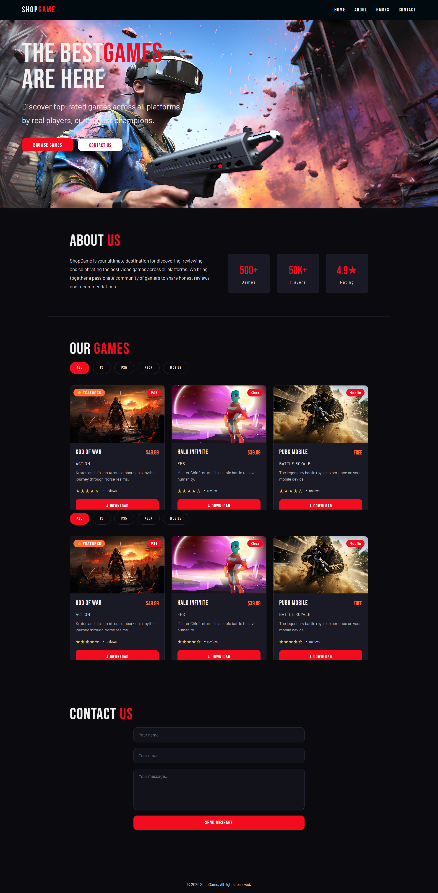

# 🎮 ShopGame - Full Stack Game Store

ShopGame is a **full-stack single-page game store application** built with the **MERN stack (MongoDB, Express, React, Node.js)** and fully containerized using Docker.

It provides a modern interface to explore games, filter by platform, read reviews, and contact the team.

---

## 🚀 Features

* 🎮 Game catalog with platform filtering
* 🧩 Single Page Application (SPA) with React
* ⭐ Review system with modal interface
* 📩 Contact form with real email sending
* ⚡ REST API built with Express
* 🐳 Fully Dockerized (frontend + backend + database)

---

## 🧱 Tech Stack

### Frontend

* React
* Axios
* CSS / Bootstrap

### Backend

* Node.js
* Express.js

### Database

* MongoDB

### DevOps

* Docker & Docker Compose

---

## 📸 Pages / Sections

* 🏠 Home
* ℹ️ About Us
* 🎮 Games
* 📬 Contact

---

## 📁 Project Structure

```bash
shopgame/
│
├── backend/
├── frontend/
├── docker-compose.yml
└── README.md
```

---

## ⚙️ Getting Started

### 1. Clone the repository

```bash
git clone https://github.com/DevDhouha/shopgame.git
cd shopgame
```

---

### 2. Environment Variables

Create `.env` file in backend:

```env
MONGO_URI=mongodb://mongo:27017/shopgame
PORT=5000
NODE_ENV=development
```

Create `.env` in frontend:

```env
REACT_APP_API_URL=http://localhost:5000/api
```

---

### 3. Run with Docker

```bash
docker-compose up --build
```

---

### 4. Access the app

* Frontend: http://localhost:3000
* Backend API: http://localhost:5000/api

---

## 🔗 API Features

* 📦 Get games list
* ⭐ Add & fetch reviews
* 📩 Send contact emails

---

## 📸 Screenshots



## 📌 Future Improvements

* 🔐 Authentication (login/register)
* ❤️ Favorites / wishlist
* 💳 Payment integration
* 📊 Admin dashboard

---

## 👤 Author

**Dhouha**
GitHub: https://github.com/DevDhouha

---

## ⭐ Support

If you like this project, give it a ⭐ on GitHub!
